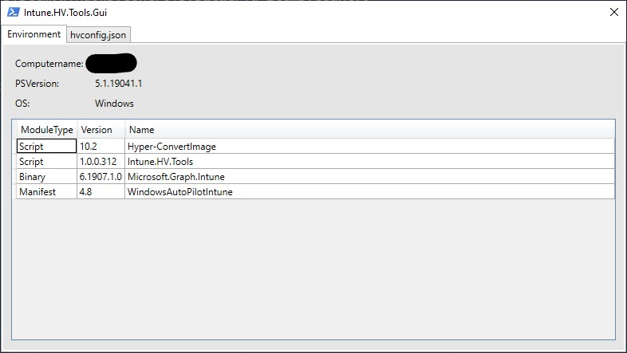

# Intune.HV.Tools.Gui

## Requirements

- [Intune.HV.Tools PowerShell Module](https://www.powershellgallery.com/packages/Intune.HV.Tools)
- PowerShell 5.1, or higher.

## How to use

Clone the whole project, including the submodules:

```
git clone https://github.com/pminnebach/Intune.HV.Tools.Gui --recursive
```

Run the `build.ps1` script.

Run the `run.ps1` script.

### Preview



## Shoulders, giants!

- [Intune.HV.Tools](https://github.com/tabs-not-spaces/Intune.HV.Tools)
- [FoxDeploy XAML to GUI](https://github.com/1RedOne/PowerShell_XAML/)

## LICENSE

